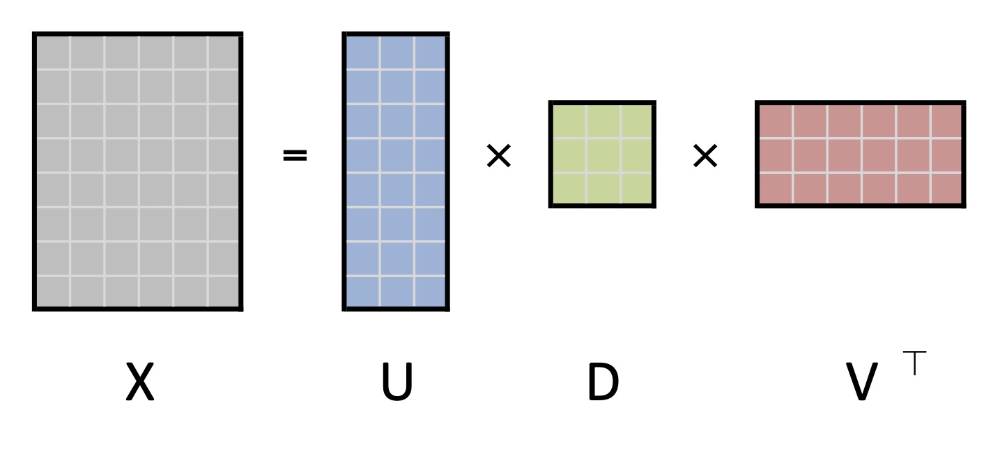
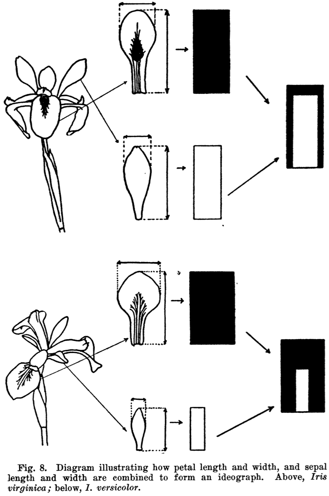
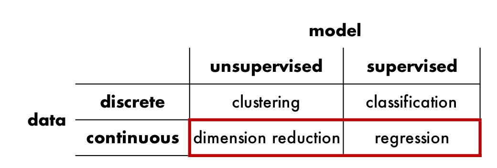
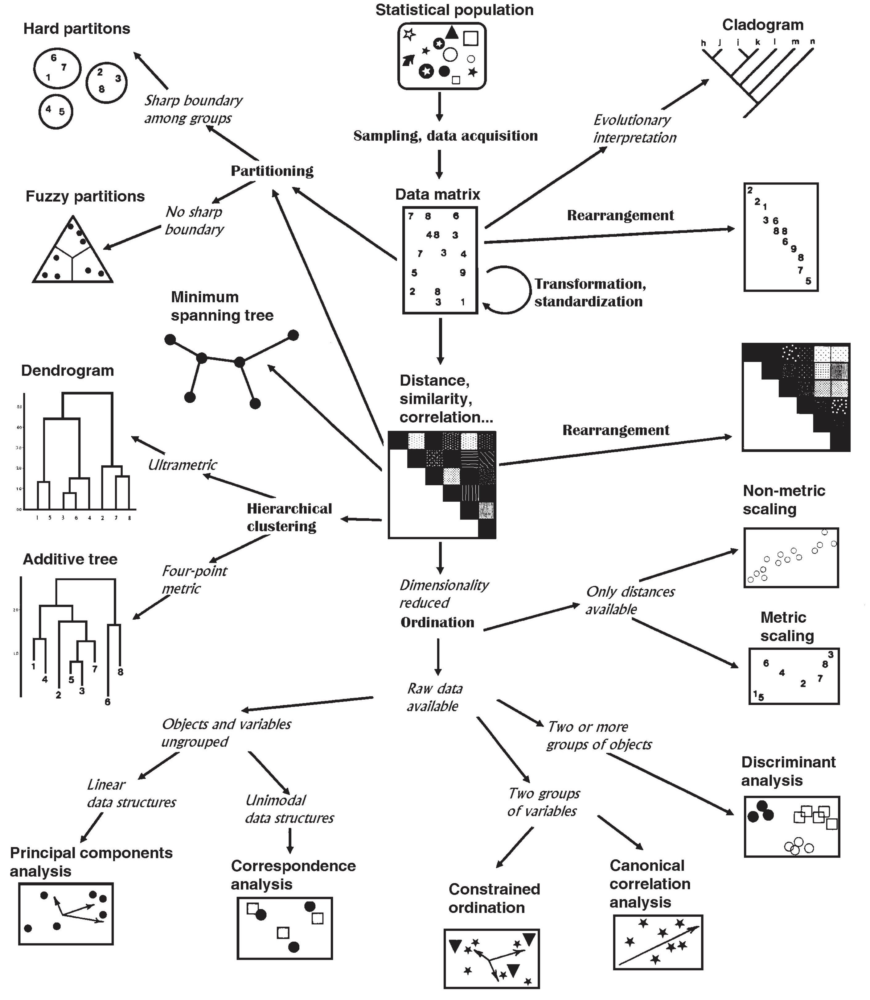
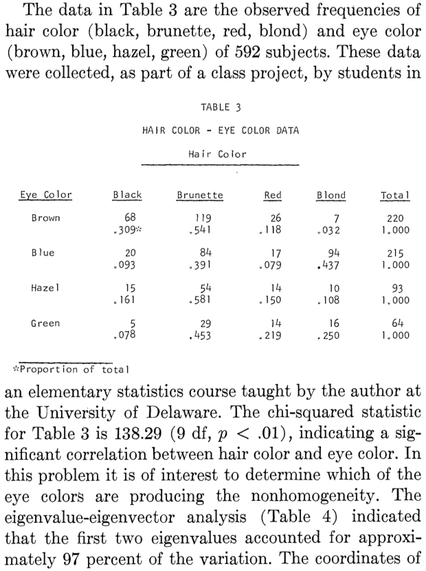
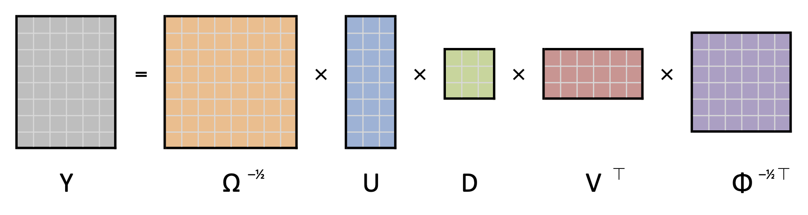
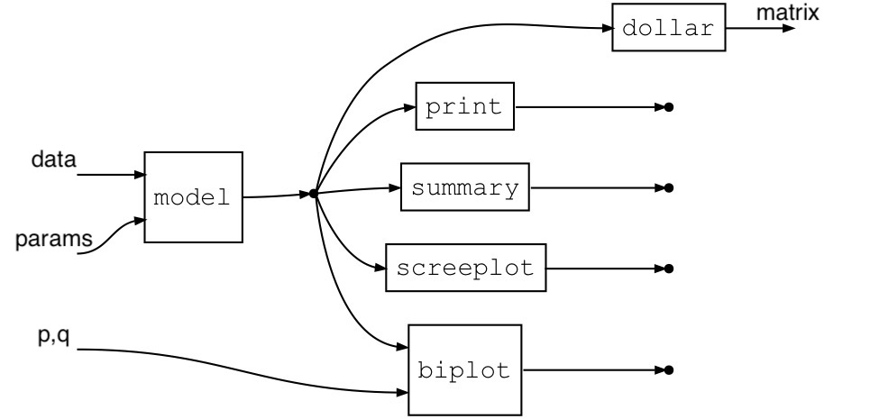
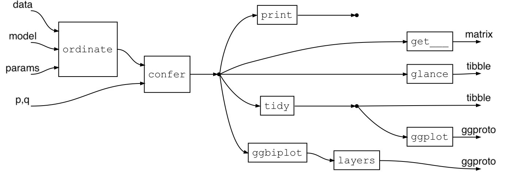
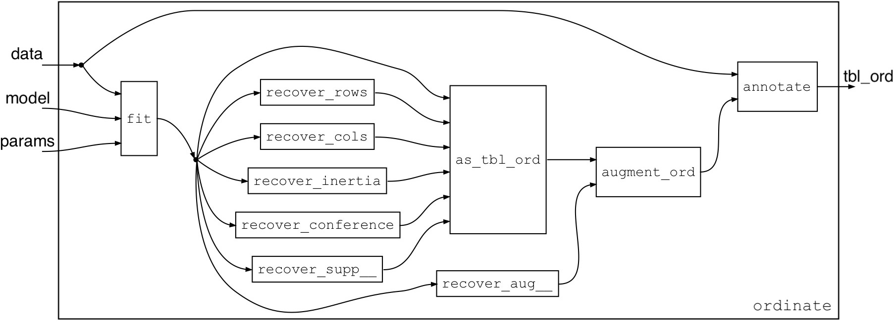

class: center

```{r setup, include=FALSE}
options(htmltools.dir.version = FALSE)
library(ordr)
library(ordr.extra)
theme_set(theme_bw())
```

<style type="text/css">
.remark-code, .remark-inline-code {
    font-size: 85%;
    <!--padding: 1em 1em 1em 1em;-->
}
</style>

## Acknowledgments

.pull-left[

### Development

Emily Paul (UPenn)

### Discussion

Joyce Robbins (Columbia)

### Applications

Tom Agresta (UConn)<br>
Ritchie Vaughan (UVA)<br>
Martinna Bertolini (UFRJ)<br>
Carol Mathews (UF)

]

.pull-right[

### Land

Potano tribe $\subset$ Timucua people

### Resources

 &nbsp; &nbsp; &nbsp; &nbsp; 

### Slideshow

**remark.js** (Ole Petter Bang) + **xaringan** (Yihui Xie)<br>
**Catlab.jl** (Evan Patterson &al)<br>
Flaticon.com

]

---
class: inverse, center, middle

# Prerequisites

---

## Singular value decomposition

1. Data matrix $X_{n \times p} \in \mathbb{R}^{n \times p}$

2. SVD into **inertia** and rotation matrices of left and right **singular vectors**:
$$X = U_{n \times k}\ D_{k \times k}\ {V_{p \times k}}^\top$$

3. Low-dimensional approximation via first $r$ **ordinates**:
$$X \approx U_r\ D_r\ {V_r}^\top$$

.center[

]

---

## Biplots

**Principal coordinates** $F = UD$ or $G = VD$ approximate the geometry of the rows or columns of $X$:

* Distances $\lVert f_{j\ \bullet} - f_{i\ \bullet} \rVert$ approximate distances $\sqrt{(x_{j\ 1} - x_{i\ 1})^2 + \cdots + (x_{j\ p} - x_{i\ p})^2}$
* Inner products $\frac{1}{n}\ g_{i\ \bullet}\cdot g_{j\ \bullet}$ approximate covariances $\operatorname{cov}(x_{\bullet\ i},x_{\bullet\ j})$
  * Cosines $\cos(\arg(g_{i\ \bullet},g_{j\ \bullet}))$ approximate correlations $\operatorname{cor}(x_{\bullet\ i},x_{\bullet\ j})$

**Standard coordinates** $U$ or $V$ pair with principal coordinates to recover the values of $X$:

* Inner products $f_{i\ \bullet}\cdot v_{j\ \bullet}$ and $u_{i\ \bullet}\cdot g_{j\ \bullet}$ approximate entries $x_{ij}$

**Biplots** superimpose row and column coordinates with shares $(a,b)$ of inertia:
$$\left[\begin{array}{c} U\ D^a \\ V\ D^b \end{array}\right] \in \mathbb{R}^{(n + p) \times r}$$

--

Pick (at most) **two out of three**:

1. Approximate row geometry &nbsp; &nbsp; &nbsp; &nbsp; 2. Approximate column geometry &nbsp; &nbsp; &nbsp; &nbsp; 3. Approximate measured values

---
class: inverse, center, middle

# Pitch: Principal components analysis

---

## PCA of Anderson's iris data

.pull-left.w45[

.center[

]

]

.pull-right.w55[

```{r}
head(iris)
summary(iris)
```

]

---

## PCA of Anderson's iris data

.pull-left[

```{r}
(pca <- prcomp(iris[, 1:4]))
```

]

.pull-right[

```{r}
(pca_ord <- ordinate(iris, prcomp, cols = 1:4))
```

]

---

## PCA of Anderson's iris data

.pull-left[

```{r, fig.height=4}
summary(pca)
screeplot(pca, type = "lines")
```

]

.pull-right[

```{r, fig.height=3.5}
tidy(pca_ord) %T>% print() %>%
  ggplot(aes(x = .name, y = .inertia, group = 1)) +
  geom_line() + geom_point()
```

]

---

## PCA of Anderson's iris data

.pull-left[

```{r, fig.height=6}
biplot(pca, scale = 0, col = c("darkgrey", "forestgreen"),
       main = "PCA of Anderson's iris data")
```

]

.pull-right[

```{r, fig.height=4.5}
pca_ord %>% confer_inertia("rows") %>%
  ggbiplot(aes(label = .name),
           sec.axes = "cols", scale.factor = 4) +
  geom_rows_point(aes(color = Species)) +
  geom_cols_vector() + geom_cols_text_radiate() +
  expand_limits(x = c(NA, 4.5), y = c(-4, NA)) +
  ggtitle("PCA of Anderson's iris data")
```

]

---
class: inverse, center, middle

# Motivation

---

## Ordination

.pull-left[

<br>

> "[A]ny technique that extracts artificial variables in order to reduce the dimensionality of the data is referred to as **ordination**."<sup>1</sup>

<br>



]

.pull-right[



]

---

## Statement of need

.pull-left[

R is replete with ordination methods!


... but they are

* **specialized**: unweildy or unintuitive inspection
* **heterogeneous**: diverse, dissimilar conventions
* **standalone**: not designed to be interoperable

]

--

.pull-right[

The tidyverse strives to be

* **human-centered**: supports data analysis conducted by humans
* **consistent**: ensures that learning transfers between packages
* **composable**: enables modular data exploration and study design
* **inclusive**: is developed and informed by a broad community of users

.center[

]

]

---

## Statement of purpose

<br>
<br>
<br>
<br>
<br>

_The {**ordr**} package leverages a **unifying framework** for matrix decomposition models and the **philosophy**, **conventions**, and **popularity** of the tidyverse in order to more **naturally** and **efficiently** integrate ordination analyses into **common** data science workflows._

---
class: inverse, center, middle

# Pitch: Correspondence analysis

---

## CA of Snee's hair and eye color data

.pull-left.w50[

.center[

]

]

.pull-right.w50[

```{r}
(haireye <- as.data.frame(rowSums(HairEyeColor, dims = 2L)))
summary(HairEyeColor)
```

]

---

## CA of Snee's hair and eye color data

.pull-left[

```{r}
(ca <- MASS::corresp(haireye, nf = 2L))
```

]

.pull-right[

```{r}
(ca_ord <- ordinate(haireye,
                    model = MASS::corresp, nf = 2L))
```

]

---

## CA of Snee's hair and eye color data

.pull-left[

```{r, fig.height=3.5}
summary(ca)
barplot(ca$cor^2,
        xlab = "Canonical dimension", ylab = "Variance")
```

]

.pull-right[

```{r, fig.height=3.5}
tidy(ca_ord) %T>% print() %>%
  ggplot(aes(x = .name, y = .cor^2)) +
  geom_col() +
  labs(x = "Canonical dimension", y = "Variance")
```

]

---

## CA of Snee's hair and eye color data

.pull-left[

```{r, fig.height=6}
biplot(ca, type = "symmetric",
       col = c("#377eb8", "#e41a1c"),
       main = "CA of Snee's hair and eye color data")
```

]

.pull-right[

```{r, fig.height=4.5}
ca_ord %>% confer_inertia("symmetric") %>%
  ggbiplot(aes(label = .name, color = .matrix)) +
  scale_color_brewer(type = "qual", palette = "Set1") +
  theme_biplot() + geom_origin() +
  geom_rows_text() + geom_cols_text() +
  ggtitle("CA of Snee's hair and eye color data")
```

]

---
class: inverse, center, middle

# Design

---

## Principles

{ordr} strives for a coherent grammar<sup>2</sup> that is

.pull-left.w08[


]

.pull-right.w90[

**accessible**
- easy to learn and straightforward to advance
- couples easily with other data science tools

]

.pull-left.w08[


]

.pull-right.w90[

**opinionated**
- foregrounds the unity of supported techniques
- rewards good practice, relieves choice paralysis

]

.pull-left.w08[


]

.pull-right.w90[

**extensible**
- relies on a small set of core generics
- borrows conventions from widely-used tools

]

---

## Inspiration

A general approach to ordination techniques:<sup>3</sup>

1. **Preprocess data** (centering; double-centering): $\displaystyle X \rightsquigarrow Y$

2. **Generalized SVD** (weights; sphering):
$$Y = (\Omega^{-1/2}\ U)\ D\ (\Phi^{-1/2}\ V)^\top$$
.center[

]

3. **Biplot**, with $a + b = 1$ (row-principal; column-principal; symmetric):
$$F = \Omega^{-1/2}\ U\ D^a,\ \ \ \ G = \Phi^{-1/2}\ V\ D^b$$

---

## Core generics

.pull-left[

### Engine

For each supported model class, **recover**:

* left & right matrix factors (singular vectors)
$$U,\ \ V$$

* inertia and its distribution unto the factors
$$D = \operatorname{diag}(d_1,\ldots,d_k),\ \ (a,b)$$

* supplementary elements
$$U\ D = X\ V,\ \ X'\ V,\ \ \text{etc.}$$

* metadata about model components

]

--

.pull-right[

### Dashboard

Via the wrapper class `'tbl_ord'`, **enable**:<sup>4</sup>

* clear & consistent formatting via {**tibble**}

* re-distribution of inertia

* negations of axes

* annotation of components via {**dplyr**}

* summaries for further analysis via {**broom**}

* grammatical construction of biplots via {**ggplot2**}

* workflows via {**magrittr**} (or `|>` if one must)

]

---

## Base R workflow

.center[

]

.pull-left.w50[

**Limitations**

* idiosyncratic fit function and output class

* retrievable model components are nonstandard

]

.pull-right.w50[

<br>

* model summaries often have no class or methods

* (bi)plots offer limited customization and annotation

]

---

## {ordr} workflow: Dashboard

.center[

]

.pull-left.w50[

**Differences**

* unified fit function and modifiable wrapper class

* retrieval methods for standard components

]

.pull-right.w50[

<br>

* model summaries are returned as data frames

* biplots can be layered

]

---

## {ordr} workflow: Engine

.center[

]

.pull-left.w50[

**Wrapper** `'tbl_ord'`

* connects underlying models to unified functions<br> by way of recovery methods

]

.pull-right.w50[

**Decorator** `augment_ord()`

* annotates recovered model components<br> with recovered metadata

]

---
class: inverse, center, middle

# Gallery

---

## Gallery: Multiple correspondence analysis of university admissions data

.pull-left[

```{r admissions mjca ord, warning=FALSE}
ca::mjca(UCBAdmissions) %>%
  as_tbl_ord() %>% augment_ord() %>%
  print() -> admissions_mca
```

]

.pull-right[

```{r admissions mjca plot, fig.height=3.5}
admissions_mca %>%
  confer_inertia("colprincipal") %>%
  ggbiplot() + theme_biplot() + geom_origin() +
  geom_cols_point(aes(color = .factor, shape = .factor,
                      size = .mass)) +
  geom_cols_text_repel(aes(label = .level, color = .factor),
                       show.legend = FALSE) +
  scale_color_brewer(palette = "Dark2") +
  scale_size_area(guide = "none") +
  labs(color = "Factor level", shape = "Factor level") +
  ggtitle("MCA of university admissions data",
          "stratified by gender, program, and outcome")
```

]

---

## Gallery: NIPALS of (incomplete) air quality data

.pull-left[

```{r nipals ord}
ordinate(airquality, seq(4L), ade4::nipals, nf = 3L) %>%
  mutate_rows(
    Month = factor(month.abb[Month], levels = month.abb),
    Missingness = apply(is.na(airquality[, 1:4]), 1L, any)
  ) %>%
  print() -> airqual_nipals
```

]

.pull-right[

```{r nipals plot, fig.height=4.5, warning=FALSE}
airqual_nipals %>%
  ggbiplot() + theme_biplot() + geom_origin() +
  stat_rows_ellipse(aes(color = Month)) +
  geom_rows_point(aes(color = Month), size = 1, alpha = .5) +
  geom_rows_point(aes(shape = Missingness), size = 3) +
  scale_shape_manual(values = c(`TRUE` = 1L, `FALSE` = NA)) +
  ggtitle("PCA of 1973 air quality measurements")
```

]

---

## Gallery: Canonical correlation analysis of psychiatric inventories

```{r, include=FALSE}
pcori_quest <- readr::read_rds("data/pcori-questionnaires.rds")
pcori_out <- readr::read_rds("data/pcori-outcome.rds")
pred <- subset(pcori_quest, select = c(98, 99, 101))
resp <- merge(
  subset(pcori_out, select = c(1, 71, 119)),
  subset(pcori_quest, select = c(1, 100, 102)),
  by = "recordid"
)
resp <- subset(resp, select = -1)
names(pred) <- c("Anxiety", "Depression", "ADHD")
names(resp) <- c("SI-R", "ADL-H", "SCI", "UHSS")
wh_complete <- complete.cases(pred) & complete.cases(resp)
pred <- pred[wh_complete, , drop = FALSE]
resp <- resp[wh_complete, , drop = FALSE]
```

.pull-left[

```{r cca ord}
cca_ord <- cancor_ord(pred, resp, scores = TRUE)
(cca_ord <- augment_ord(as_tbl_ord(cca_ord)))
```

]

.pull-right[

```{r cca, fig.height=4}
cca_ord %>% confer_inertia("rows") %>%
  ggbiplot(aes(label = .name, color = .matrix)) +
  geom_unit_circle() +
  geom_rows_vector(elements = "structure", arrow = NULL) +
  geom_cols_vector(elements = "structure", arrow = NULL) +
  geom_rows_text(elements = "structure", hjust = "outward") +
  geom_cols_text(elements = "structure", hjust = "outward") +
  expand_limits(x = c(-1, 1), y = c(-1, 1)) +
  ggtitle("Str. correlations of psychiatric inventories")
```

]

---

## Gallery: Linear discriminant analysis of diabetes data

.pull-left[

```{r diabetes lda ord}
MASS::lda(group ~ ., heplots::Diabetes) %>%
  as_tbl_ord() %>% augment_ord() %>%
  mutate_rows(discriminant = ifelse(
    .element == "active", "centroid", "case"
  )) %>%
  print() -> diabetes_lda
```

]

.pull-right[

```{r diabetes lda plot, fig.height=4.5, warning=FALSE}
diabetes_lda %>% confer_inertia(1) %>%
  ggbiplot() + theme_biplot() +
  geom_rows_point(aes(shape = .grouping, size = discriminant),
                  alpha = .5) +
  geom_cols_axis(aes(label = .name),
                 color = "#888888", num = 8L,
                 text_size = 2.5, label_dodge = .02) +
  ggtitle("Standardized LDA of diabetes groups")
```

]

---
class: inverse, center, middle

# Wrap

---

## Needs

.pull-left.w08[


]

.pull-right.w90[

**Engagement**

* bug & need reports

* use cases

* code contributions

]

.pull-left.w08[


]

.pull-right.w90[

**Documentation**

* how to use {ordr} with **new model classes**

* how to use **new plot layers** with `ggbiplot()`

]

.pull-left.w08[


]

.pull-right.w90[

**Features**

* quality measures

* predictive biplots<sup>5</sup>

]

---

## Welcome

Install **ordr**, and optionally methods for additional S3 classes:

```r
remotes::install_github("corybrunson/ordr")
remotes::install_github("corybrunson/ordr.extra")
```

## Thank you!

.footnote[

[1] Podani J • 2000 • _Introduction to the Exploration of Multivariate Biological Data_ • <http://ramet.elte.hu/~podani/books.html>

[2] Wilkinson L • 2005 • _The Grammar of Graphics_ • <https://link.springer.com/book/10.1007/0-387-28695-0>

[3] Greenacre M • 1984 • _Theory and applications of correspondence analysis_ • <http://www.carme-n.org/>

[4] Pedersen TL • 2022 • {tidygraph}: A Tidy API for Graph Manipulation • <https://CRAN.R-project.org/package=tidygraph>

[5] Gower JC, Lubbe SG, le Roux NJ • 2011 • _Understanding Biplots_ • <https://www.wiley.com/go/biplots>

]
