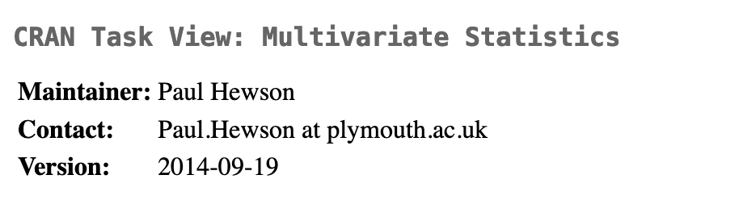
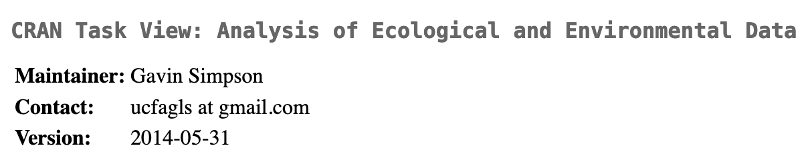
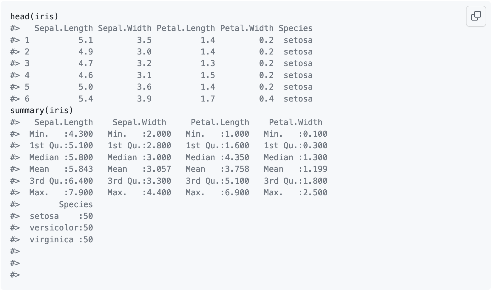
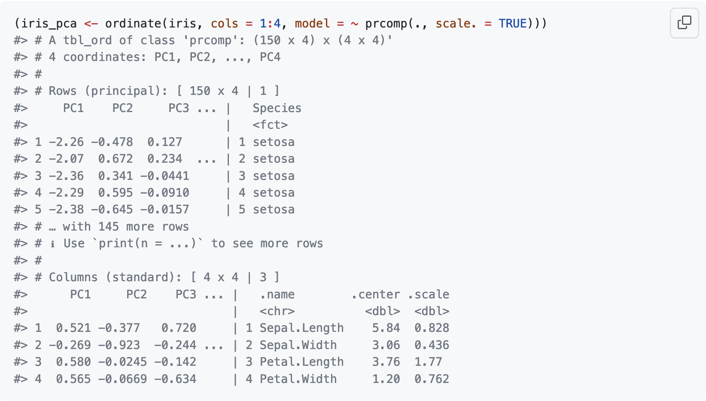
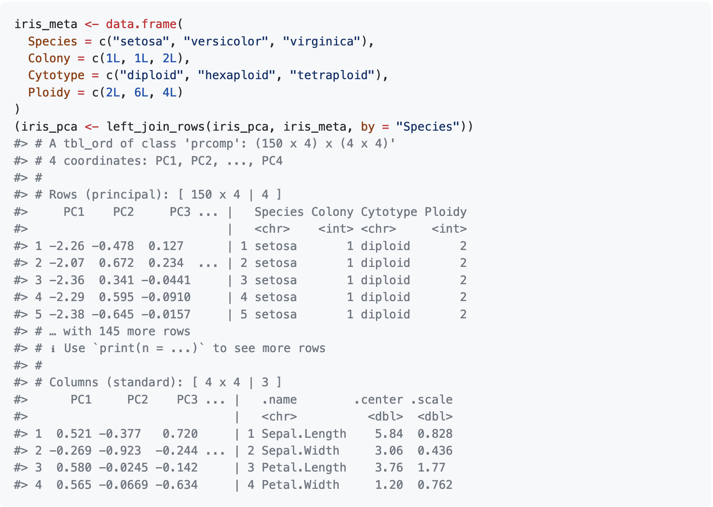
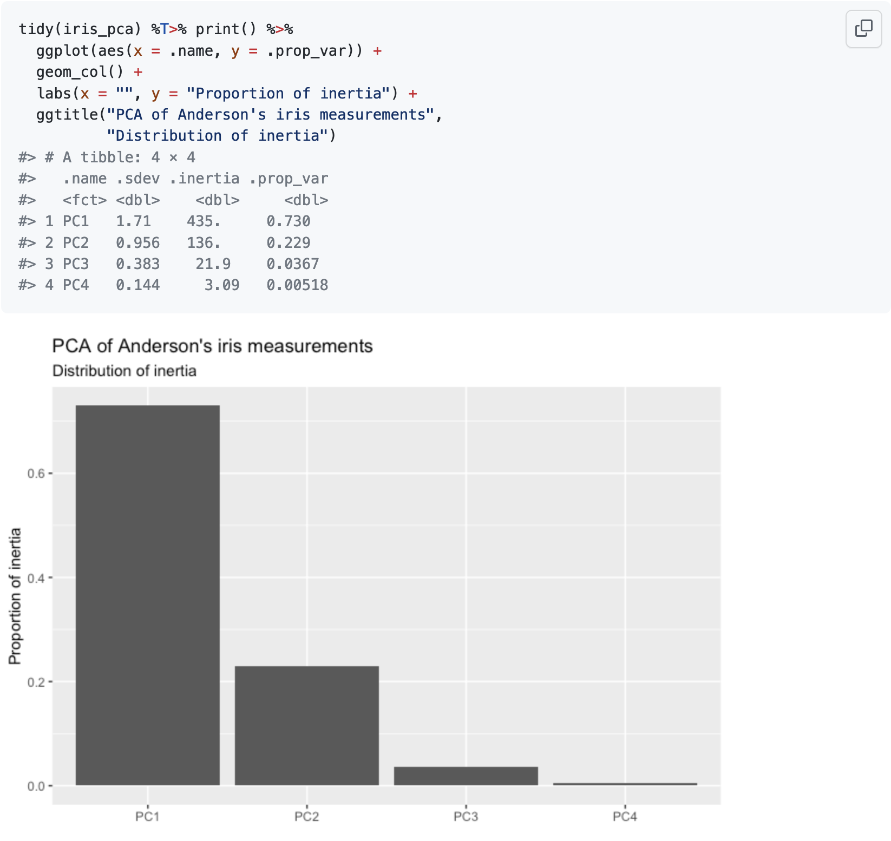
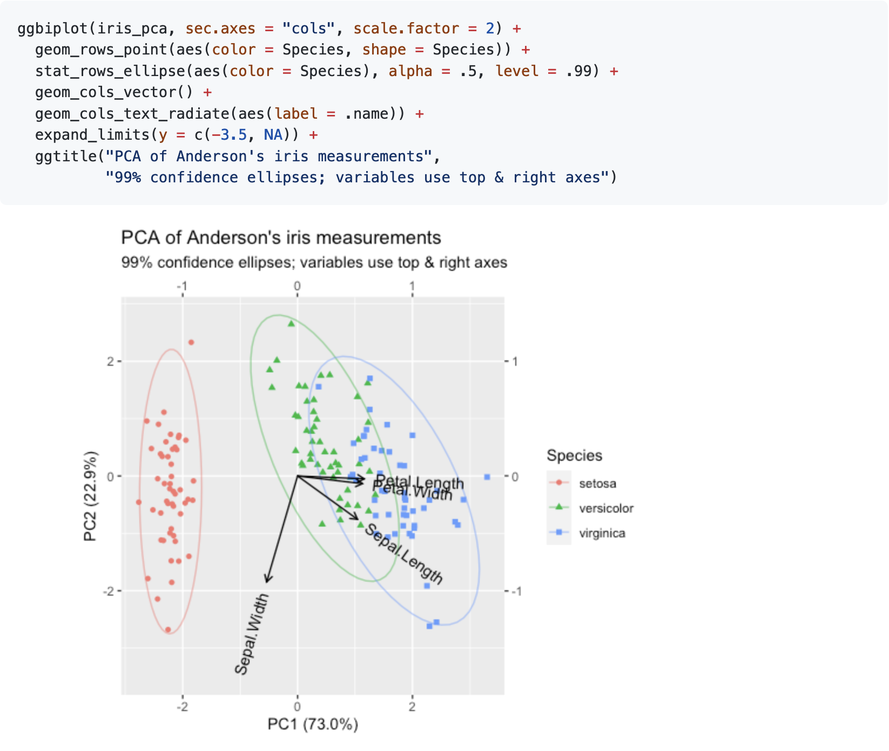
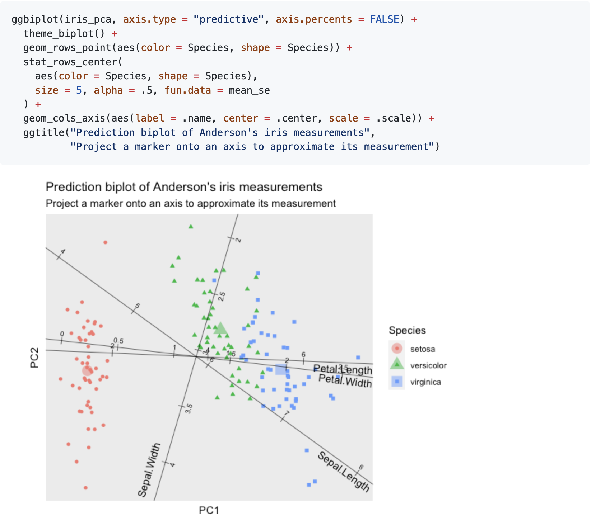
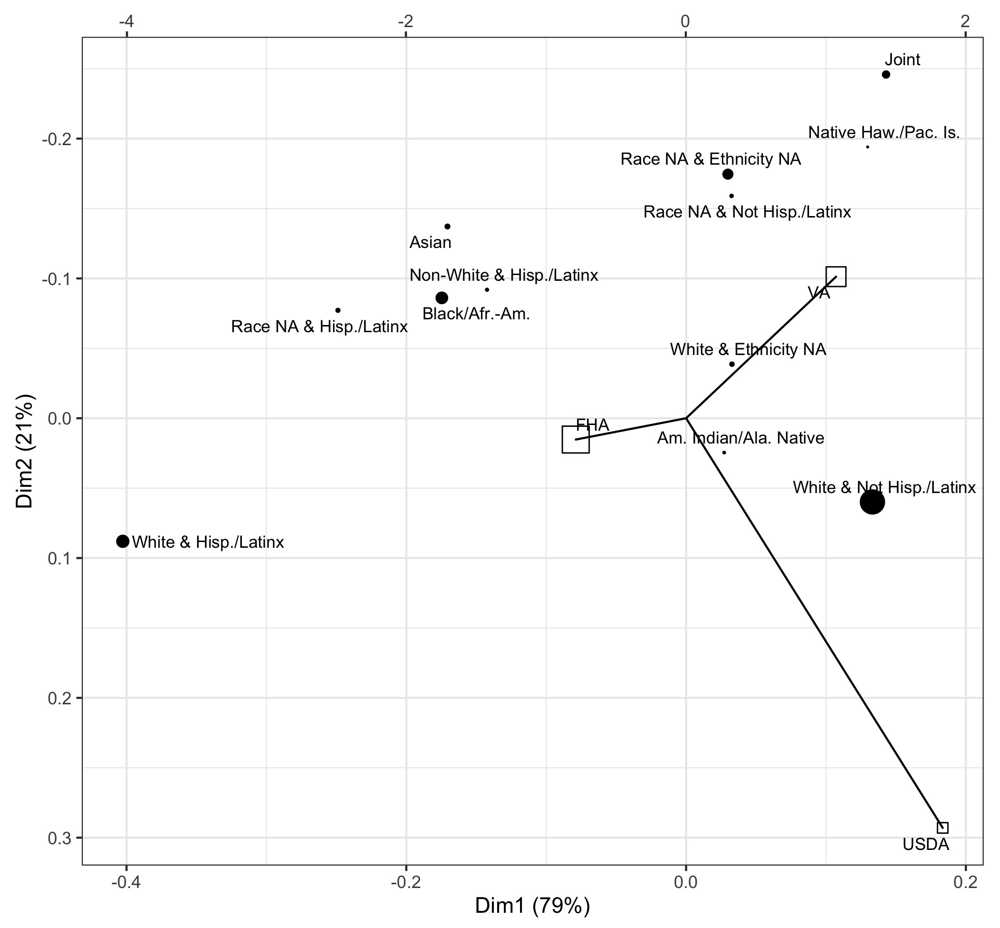

\setlength\itemsep{2em}

## Acknowledgments

\columnsbegin[t]

\column{.45\textwidth}

\blockbegin{Development}

* Emily Paul (UPenn)

\blockend

\blockbegin{Discussion}

* Joyce Robbins (Columbia)

\blockend

\blockbegin{Experiment}

* Tom Agresta (UConn)
* Ritchie Vaughan (UVA)
* Martinna Bertolini (UFRJ)
* Carol Mathews (UF)

\blockend

\column{.45\textwidth}

\blockbegin{Support}

\centering
\vspace{3ex}

\includegraphics[width=.45\textwidth]{img/uconn-health-wordmark-stacked-blue.png}

\vspace{3ex}

\includegraphics[width=.25\textwidth]{img/Vertical_Logo-RGB_Raster-ORANGE.png}

\vspace{3ex}

\blockend

\columnsend

# Pitch

# Previous version

# Theory

## Ordination

\columnsbegin[c]
\column{.5\textwidth}

> "[A]ny technique that extracts artificial variables in order to reduce the dimensionality of the data is referred to as **ordination**."

\vspace{3ex}

\column{.4\textwidth}

\includegraphics[width=.9\textwidth,trim=0 0 0 400]{img/podani-fig0-1}

\columnsend

\vfill\raggedleft\tiny
Podani J • 2000 • _Introduction to the Exploration of Multivariate Biological Data_ • <https://web.archive.org/web/20200221000313/http://ramet.elte.hu/~podani/books.html>

## Principal components analysis

### Derivation

\columnsbegin[b]
\column{.29\textwidth}

* $X_{n \times p}$ data
* $\overline{x}_{n \times 1}$ data centroid

\column{.69\textwidth}

* $Y = X - 1\overline{x}^\top$ centered data
* $Y = U_{n \times q} D_{q \times q} V^\top_{q \times p}$ singular value decomposition

\columnsend

### Interpretation

\columnsbegin[b]
\column{.59\textwidth}

* $D$ inertia
* $U_r,V_r$ standard coordinates (orthonormal)
* $U_r D_r,V_r D_r$ principal coordinates

\column{.39\textwidth}

* $V_r$ variable loadings
* $U_r D_r$ case scores

\columnsend

### Application

\columnsbegin[b]
\column{.39\textwidth}

* $X'$ new data

\column{.59\textwidth}

* $(X' - 1\overline{x}^\top) V_r$ scores (supplementary)

\columnsend

## Linear discriminant analysis

### Derivation

\columnsbegin[b]
\column{.49\textwidth}

* $G_{n \times k}$ groups
* $N = \diag(n_1,\ldots,n_k)$ group counts
* $\overline{X}_{k \times p} = N^{-1} G^\top X$ group centroids

\column{.54\textwidth}

* $C = \frac{1}{n} X^\top X$ covariance matrix
* $\overline{Y} = \overline{X} - 1\overline{x}^\top$ centered group centroids
* $\overline{Y} C^{-1/2} = U_{k \times q} D_{q \times q} V^\top_{q \times p}$

\columnsend

### Interpretation

\columnsbegin[b]
\column{.39\textwidth}

* $V_r$ variable loadings

\column{.59\textwidth}

* $U_r D_r = \overline{Y} C^{-1/2} V$ group centroid scores

\columnsend

### Application

\columnsbegin[b]
\column{.54\textwidth}

* $Y C^{-1/2} V_r$ case scores (supplementary)

\column{.54\textwidth}

* $X'$ new data
* $X' C^{-1/2} V_r$ scores (supplementary)

\columnsend

## General Multidimensional Analysis

1. Preprocess data $X \rightsquigarrow Y$
    * centering
    * double-centering
2. Generalized SVD $Y = N D M^\top = (A^{-1/2} U) D (B^{-1/2} V)^\top$, where\linebreak
    $A,B$ are positive semi-definite and\linebreak
    $N^\top A N = M^\top B M = I$ (orthonormalization)
    * weights
    * sphering

    Low-rank approximation $Y \approx N_r D M_r^\top$
4. Biplot of $F = U_r D^a$ and $G = V_r D^b$,\ \ with $a + b = 1$
    * row-principal
    * column-principal
    * symmetric

\vfill\raggedleft\tiny
Greenacre M • 1984 • _Theory and applications of correspondence analysis_ • <http://www.carme-n.org/>

# Motivation

## Need

\columnsbegin[t]
\column{.49\textwidth}

R is replete with ordination methods!

\vspace{2ex}

{ width=75.58% }

\vspace{2ex}

\column{.49\textwidth}

... but they are

* **specialized**: unweildy & uninformative inspection methods
* **heterogeneous**: diverse, dissimilar, domain-specific conventions
* **standalone**: not easily interoperable with other tools or integrable into external workflows

\columnsend

## Design

Typical implementations:

\vspace{8ex}

General implementation:

\vspace{8ex}

Tidy management:

\vspace{8ex}

## Inspiration

\columnsbegin[t]
\column{.49\textwidth}

> [T]he **tidyverse** is a collection of R packages that share a high-level design philosophy and low-level grammar and data structures, so that learning one package makes it easier to learn the next.

\centering
\includegraphics[width=.25\textwidth]{img/tidyverse-logo.png}

\column{.49\textwidth}

The tidyverse strives to be

* **human-centered**: supports data analysis conducted by humans
* **consistent**: ensures learning transfers between packages
* **composable**: enables modular thinking and doing
* **inclusive**: developed and informed by a broad community

\columnsend

\vfill\raggedleft\tiny
Wickham &al • 2019 • _The Journal of Open Source Software_ • <doi:10.21105/joss.01686>\linebreak
Tidyverse team • _Tidyverse design guide_ • <https://design.tidyverse.org/>

## Inspiration

\columnsbegin[c]
\column{.49\textwidth}

\centering
{ width=20% }

lazy, surly, & pithy data frames

\column{.49\textwidth}

\centering
{ width=20% }

relational algebra for data sets

\columnsend

\vspace{4ex}

\columnsbegin[c]
\column{.49\textwidth}

\centering
{ width=20% }

convenient summarization\linebreak of statistical models

\column{.49\textwidth}

\centering
{ width=20% }

grammatical production\linebreak of statistical graphics

\columnsend

## Implementation

\columnsbegin[t]
\column{.59\textwidth}

\blockbegin{Engine}

\vspace{2ex}

Recovery methods for \alert{(your!)} S3 model classes:

* left & right matrix factors (singular vectors)\linebreak
$U_{n \times k},\ \ V_{p \times k}$
* transformations of coordinate spaces\linebreak
$A_{n \times n},\ \ B_{p \times p}$
* inertia and its distribution unto the factors\linebreak
$D = \diag(d_1,\ldots,d_k),\ \ (a,b)$
* active & supplementary elements\linebreak
$U_r D_r = X V_r,\ \ X' V_r$

\blockend
\column{.44\textwidth}

\blockbegin{Dashboard}

\vspace{2ex}

Class 'tbl_ord':

* wrapper for ordination models
* clear & consistent formatting

Functions:

* augment with model metadata
* redistribution of inertia
* tidily inspect & summarize
* annotate rows and columns
* build biplots grammatically
* add ordination plot layers

\blockend
\columnsend

# Illustration

## Example workflow

\columnsbegin[t]
\column{.5\textwidth}

\column{.5\textwidth}

\columnsend

## Example workflow

\columnsbegin[t]
\column{.5\textwidth}

\column{.5\textwidth}

\columnsend

## Example workflow

\columnsbegin[t]
\column{.5\textwidth}

\column{.5\textwidth}

\columnsend

# Use cases

## Origination of home loans by program and racial-ethnic group

\centering
{ width=50% }

## Associations between hoarding and other mental health disorders

\centering
{ width=120% }

## Use case 3

# Ongoing work

## Limitations & needs

\columnsbegin[t]
\column{.59\textwidth}

S3 class methods

* quality measures
* interpolation
* prediction
* predictive biplot elements

\vspace{2ex}

Biplot functionality

* predictive biplots
* joint row-and-column layers
    * interpolative vector sum
    * predictive projection

\column{.39\textwidth}

Involvement

* \alert{accessibility}
* issues
* contributions

\columnsend

## Fin

> This is the end

> Beautiful friend

<!--
pandoc tidy-factor.md \
  -t beamer \
  --include-in-header=environment-shortcuts.tex \
  -o tidy-factor.pdf

  --toc \
  -o tidy-factor.tex \
  -s
-->
